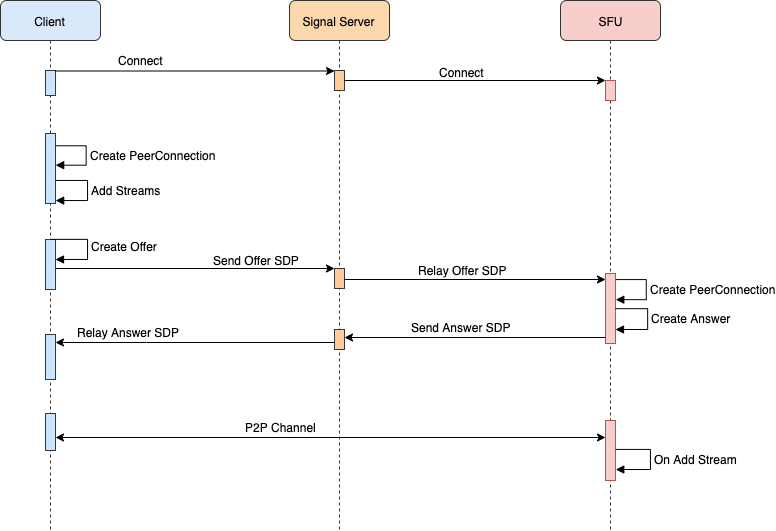
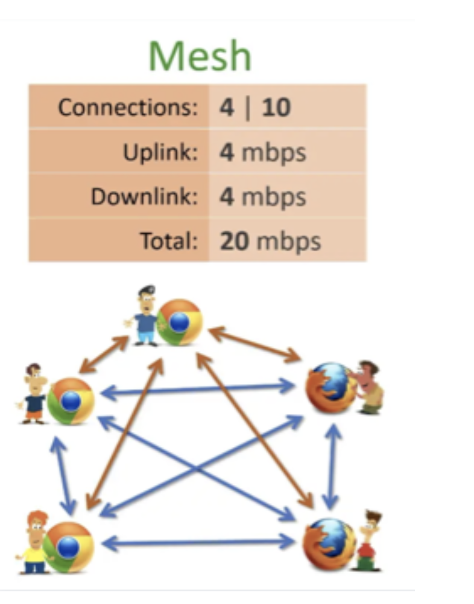
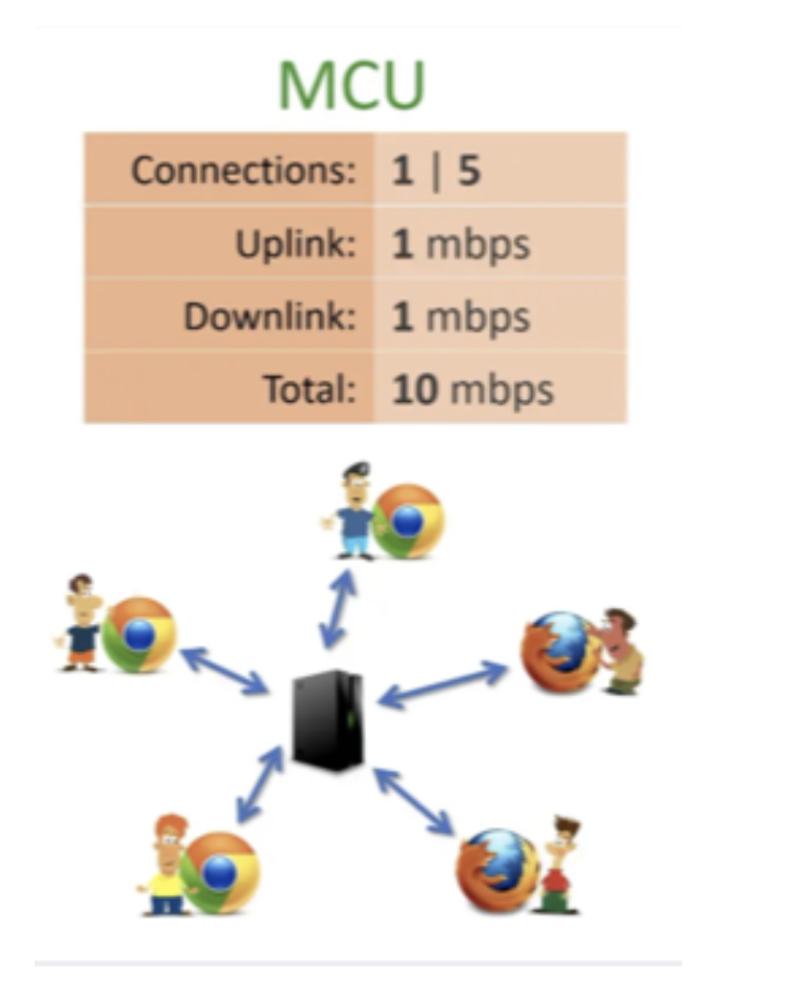
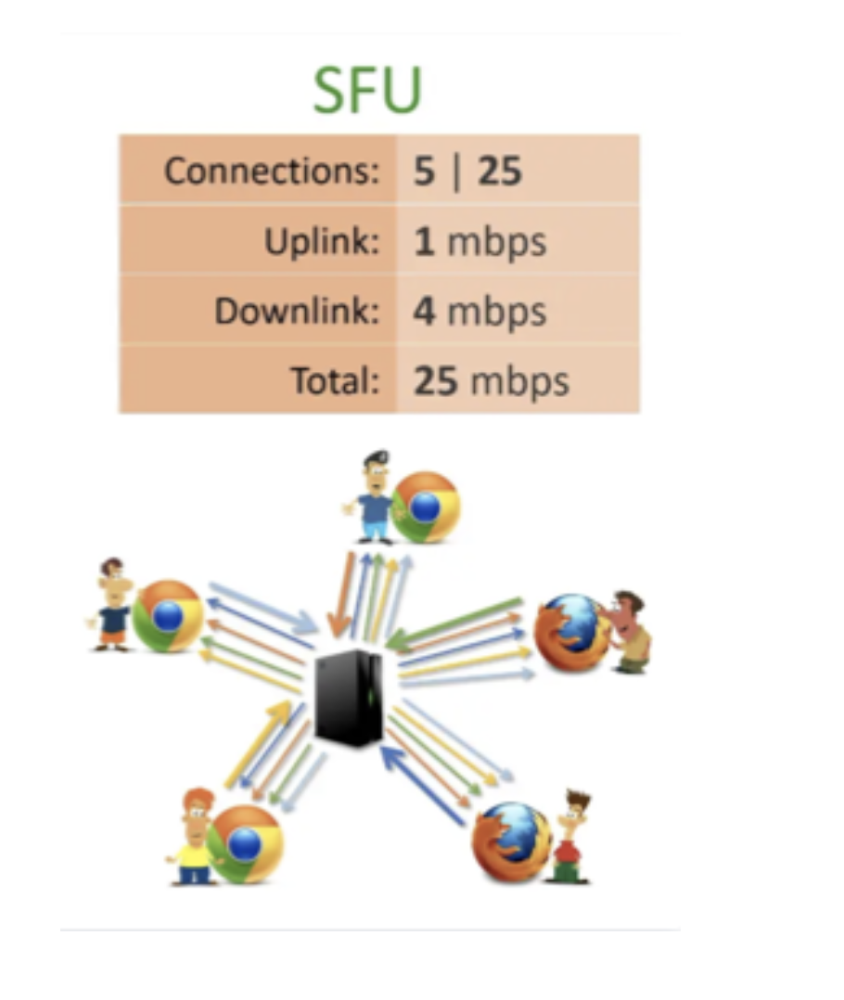
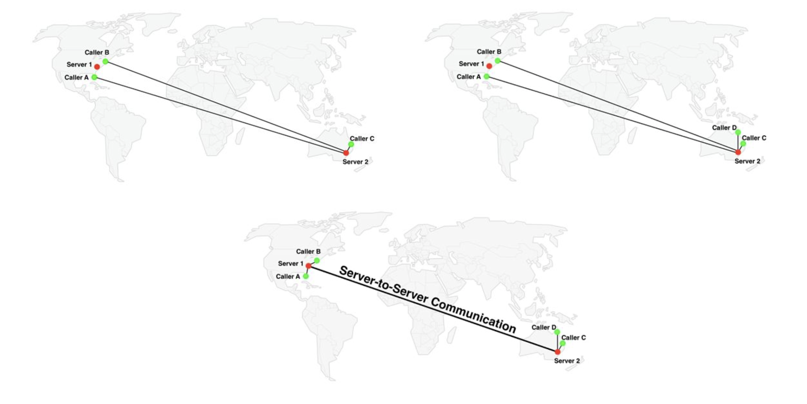

# 介绍
WebRTC (Web Real-Time Communications) 是一项实时通讯技术，它允许网络应用或者站点，在不借助中间媒介的情况下，建立浏览器之间点对点（Peer-to-Peer）的连接，实现视频流和（或）音频流或者其他任意数据的传输。WebRTC包含的这些标准使用户在无需安装任何插件或者第三方的软件的情况下，创建点对点（Peer-to-Peer）的数据分享和电话会议成为可能。
# 概要
- 第一，通信双方需要先通过服务器交换一些信息
- 第二，完成信息交换后，通信双方将直接进行连接以传输音视频数据

# 组成
## 信令
webrtc规定了需要交换`sdp`，具体怎么交换，以及交换的方式，没有规定。只是定义了框架和接口，具体实现不限制。
### 为什么信令不是由WebRTC定义的？
为了避免出现冗余，并最大限度地提高与已有技术的兼容性，WebRTC标准并没有规定信令方法和协议。JavaScript会话建立协议JSEP概述了这种方法：
WebRTC通话建立的思想是完全指定和控制媒体平面，但是尽可能将信令平面留给应用程序。其原理是，不同的应用程序可能更喜欢使用不同的协议，例如现有的SIP或Jingle呼叫信令协议，或者对于特定应用程序定制的东西，可能是针对新颖的用例。在这种方法中，需要交换的关键信息是多媒体会话描述，其指定了建立媒体平面所必需的传输和媒体配置信息。
JSEP的架构也避免了浏览器不得不保存状态，即作为一个信号状态机。如果信号数据在每次刷新页面的时候都会发生丢失，就会出现问题。相反，信号状态机可以保存在服务器上。

- 信令服务器
- 传输协议
  - websocket
  - sip
  - http(srs)
- 流程
  - 收集信息
      - 需要的服务
        - STUN
          - 获取自己公网ip
          - p2p打洞，nat类型
        - TURN - relay
        - ICE - 二者整合
    - 公网ip
    - NAT类型
      
  - 交换sdp、candidate
  - 建立p2p通道
  
## 流媒体
### DTLS
DTLS的主要用途，就是让通信双方协商密钥，用来对数据进行加解密。
- 通信双方：通过DTLS握手，协商生成一对密钥；
- 发送方：对数据进行加密；
- 发送方：通过UDP传输加密数据；
- 接收方：对加密数据进行解密；
### srtp
SRTP、SRTCP，分别在RTP、RTCP的基础上加了个S(Secure)，表示安全的意思

#### 音视频数据的发送过程：
- 通信双方：通过DTLS握手，协商生成一对密钥；
- 数据发送方：将音视频数据封装成RTP包，将控制数据封装成RTCP包；
- 数据发送方：利用加密密钥，对RTP包、RTCP包进行加密，生成SRTP包、SRTCP包；
- 数据发送方：通过UDP传输SRTP包、SRTCP包；

### SCTP
tream Control Transmission Protocol）：流控制传输协议。
RTP/RTCP主要用来传输音视频，是为了流媒体设计的。而对于自定义应用数据的传输，WebRTC中使用了SCTP协议。

# 流程

- 终端连接到 信令服务器，准备为两端进行信令交换。
- 发起端创建 PeerConnection，生成Offer 信令（SDP），通过 信令服务器 转发给另一端。
  SDP：描述建立音视频连接的一些属性，如音频的编码格式、视频的编码格式、是否接收/发送音视频等等。
- 响应端收到Offer 信令之后，生成Answer 信令（SDP）, 返回给发起端。
- 收到offer以后调用RTCPeerConnection.setRemoteDescription加入remote sdp
- WebRTC客户端先去连接ICE Server，也就是STUN Server或者TURN Server。
- 客户端连接STUN Server是为了测试出自己的NAT类型和获取到自己公网ip地址
- TURN Server包含了STUN Server的功能而且包含Relay中转功能。
- 当一个WebRTC客户端创建RTCPeerConnection并且设置好ICE和本地Audio Track、Video Track以后，会自动向ICE服务器发出测试然后得到ice candidate
- 交换完SDP之后，相互发送自己的Candidate信息。  Candidate：主要包含了相关方的IP信息，包括自身局域网的ip、公网ip、turn服务器ip、stun服务器ip等。
- 有了ip信息之后， 开始尝试进行 P2P打洞（打洞过程是框架实现的，如想知道打洞原理，可自行百度）。若打洞不成功，则会改用服务器转发。
- 无论是打洞还是转发，只要有一条路是成功的，那PeerConnection就算是成功建立了。接下来就可以进行音视频通话了。

##  SFU模式 PeerConnection 建立过程
SFU 模式下，SFU 服务都会有自己的固定公网IP地址，这个先决条件简化了 WebRTC 中 peerConnection 的建立过程，可以把这种场景理解为 P2P 通信的一端确定在 NAT 前面，并且有固定IP地址的特殊情况，这时对于 SFU 服务没有必要再去收集自己的 iceCandidate，所以 ICE 协议(RFC5245) 中定义了一种 lite 实现方式，简化了有固定IP公网地址一端的 ice 实现方式，只要满足固定公网IP的前提条件，通过 lite 方式实现一个 ice server，完全实现 ice 协议的对端将毫无感知的与 lite 实现建立常规的 peerConnection 通信信道。

ice-lite 有以下几个特点：

- ICE 的 Lite 实现不需要实现 Candidate 的收集过程；只需要提供 Host Candidate；
- 不需要实现连通性检查或者状态机，只需要实现连通性检查的Response；
- ICE Lite 在交互过程中只能是 controlled 角色，并且不能使用 USE-CANDIDATE 来做 ice nomination；  
常规的 SFU 都会自身集成一个 ice lite 实现的 ice server，所以交互过程中省去了 ice server 的独立角色。SFU 的 SDP 信息中会携带自身的 Host Candidate 和 'a=ice-lite' 属性，当对端收到 'a=ice-lite'  属性后会自动将自己设置成 controlling 角色，主动与 SFU 的 ice agent 进行交互。同时 SFU 也不需要对端的 iceCandidate 信息，因为在对端发起 stun binding 测试连通性的时候就可以获取对端的信息，便可以建议一个 Transport tuple 用来维持 peerConnection 通信。

下图是 SFU 模式下 peerConnectionn 的建立过程：


# 实现流程
- addStream方法将getUserMedia方法中获取的流(stream)添加到RTCPeerConnection对象中，以进行传输
- onaddStream事件用来监听通道中新加入的流，通过e.stream获取
- onicecandidate事件用来寻找合适的ICE
- createOffer()是RTCPeerConnection对象自带的方法，用来创建offer，创建成功后调用setLocalDescription方法将localDescription设置为offer，localDescription即为我们需要发送给应答方的sdp
- sendOffer和sendCandidate方法是自定义方法，用来将数据发送给服务器

# rtc常见后端架构
## Mesh
    

每个端都与其它端互连。
以左图为例，5个浏览器，二二建立p2p连接，每个浏览器与其它4个建立连接，总共需要20个连接。如果每条连接占用1m带宽，则每个端上行需要4m，下行带宽也要4m，总共带宽消耗40m。而且除了带宽问题，每个浏览器上还要有音视频“编码/解码”，cpu使用率也是问题，一般这种架构只能支持4-6人左右，不过优点也很明显，没有中心节点，实现很简单。
### 优点
- 1.实现简单
- 2.成本优势
### 缺点
- 1. 带宽和性能要求较高，适用于参会人数较少的场景
- 2. 连通性问题
- 3. 跨区域，跨运营商等问题，质量无法保证

## MCU
    

这是一种传统的中心化架构。
每个浏览器仅与中心的MCU服务器连接，MCU服务器负责所有的视频编码、转码、解码、混合等复杂逻辑，每个浏览器只要1个连接，整个应用仅消耗5个连接，带宽占用(包括上行、下行）共10m，浏览器端的压力要小很多，可以支持更多的人同时音视频通讯，比较适合多人视频会议。但是MCU服务器的压力较大，需要较高的配置。
### 优点
- 1.可以支持超大房间，适合对布局没有个性化场景的多人视频会议
- 2.对客户端的带宽和CPU 性能要求较低
- 3.放宽异种终端（不同的音视频编解码）限制，兼容性较好
### 缺点
- 1. 难以支持客户端侧拥有更多显示布局的灵活性要求
- 2. 服务端成本高昂，难以支持大量的房间

## SFU
    

有中心节点服务器，但是中心节点只负责转发，不做太重的处理，所以服务器的压力会低很多，配置也不像MCU要求那么高。但是每个端需要建立一个连接用于上传自己的视频，同时还要有N-1个连接用于下载其它参与方的视频信息。所以总连接数为5*5，它的典型场景是1对N的视频互动

### 优点
- 1.只负责转发对负载要求较低，能支持大批量的房间
- 2. 有中心节点转发，能解决连通性和跨地区，跨运营商等问题
- 3. 可以支持客户端灵活的显示布局要求
### 缺点
- 1. 带宽和性能要求较高，适用于参会人数较少的场景
- 2. 转发的质量由订阅端网络最差者决定
- 3. 不支持异种终端的接入

## 级联


# 调试工具
chrome://webrtc-internals 

# 弱网对抗技术

## 第一类：关键帧请求
主要包括SLI／PLI／FIR，作用是在关键帧丢失无法解码时，请求发送方重新生成并发送一个关键帧。这本质是一种重传，但是跟传输层的重传的区别是，它重传是最新生成的帧。

## 第二类：重传请求
主要包括RTX／NACK／RPSI
这个重传跟关键帧请求的区别是它可以要求任意帧进行重传

## 第三类：码率控制
主要包括REMB／TMMBR／TMMBN
TMMBR是Temporal Max Media Bitrate Request，表示临时最大码率请求。表明接收端当前带宽受限，告诉发送端控制码率。REMB是ReceiverEstimated Max Bitrate，接收端估计的最大码率。TMMBN是Temporal Max Media Bitrate Notification

## 第四类：冗余包
音视频FEC（Forward Error Correction，前向纠错）前向纠错技术来进行丢包恢复，由发送方进行FEC编码引入冗余包，接收方进行FEC解码并恢复丢失的数据包。

WebRTC中音频前向纠错与视频前向纠错的方式不同，音频前向纠错遵循RFC2198标准，视频前向纠错遵循RFC5109标准。两者有差异的原因是音频传输所占据的带宽比较小，即使增加1倍的带宽冗余，也不会造成太大的影响，而视频的一帧比较大，通常需要几个RTP数据包才能完全发送，因此不能像音频一样具有较大的冗余力度。

# srs前期webrtc demo的web代码
```
<!DOCTYPE html>
<html lang="zh-cmn-Hans">
<head>
<meta charset="utf-8">
</head>

<body>

rtc_media_player: <br>
<video id = "rtc_media_player" autoplay></video>

</body>

<script>

var PeerConnection = window.RTCPeerConnection || window.mozRTCPeerConnection || window.webkitRTCPeerConnection;
var SessionDescription = window.RTCSessionDescription || window.mozRTCSessionDescription || window.webkitRTCSessionDescription;

var url = "http://localhost:1985/api/v1/sdp/";

var method = "POST";
var shouldBeAsync = true;

var request = new XMLHttpRequest();

request.open(method, url, shouldBeAsync);
request.setRequestHeader("Content-Type", "application/json;charset=UTF-8");

var pc = new PeerConnection(null);

var constraints = {
    mandatory: {
        OfferToReceiveAudio: true,
        OfferToReceiveVideo: true
    }
};

var sendViewerOfferFn = function(desc) {
    console.log('sendViewerOfferFn:', desc);

    pc.setLocalDescription(desc);

    var sdp_json = {"sdp":desc.sdp, "app":"webrtc", "stream":"test"};
    request.send(JSON.stringify(sdp_json));
};

pc.createOffer(sendViewerOfferFn, 
    function(error) { 
        console.log('sendViewerOfferFn error:' + error); 
    }, 
    constraints
);

pc.onaddstream = function(event) {
    console.log('onaddstream');
    document.getElementById('rtc_media_player').srcObject = event.stream;
    rtc_media_player.load();
};

pc.onicecandidate = function(event) {
    console.log('onicecandidate');
};

pc.onconnectionstatechange = function(event) {
    console.log('onconnectionstatechange');
};

pc.onicegatheringstatechange = function(event) {
    console.log('onicegatheringstatechange');
};

pc.onsignalingstatechange = function(event) {
    console.log('onsignalingstatechange');
};

request.onerror = function(event) {
    console.log('http error');
};

request.onload = function () {
    console.log('onload,' , request.responseText);
    var json = JSON.parse(request.responseText);
    console.log('onmessage viewerResponse:', json.sdp);

    pc.setRemoteDescription(new SessionDescription({type:'answer', sdp:json.sdp}));
}

</script>

</html>

```
# 链接
- [webrtc api](https://developer.mozilla.org/en-US/docs/Web/API/WebRTC_API)
- [srs rtc pr](https://github.com/ossrs/srs/pull/1638)
- [srs rtc issue](https://github.com/ossrs/srs/issues/307)
- [srs摄像头推流webrtc播放演示](https://www.cnblogs.com/dong1/p/12712229.html)
- [srs普通推流webrtcp播放](https://segmentfault.com/a/1190000024533847)
- [webrtc cdn实现](https://zhuanlan.zhihu.com/p/143974932?utm_source=wechat_session&utm_medium=social&s_r=0)
- [SCTP](https://tools.ietf.org/html/rfc4960)
- [DTLS](https://tools.ietf.org/html/rfc4347)
- [关于sfu级联](https://my.oschina.net/u/3521704/blog/4592305)
- [srs webrtc回源](https://github.com/ossrs/srs/issues/2091)
- [rtc demo](https://webrtc.github.io/samples/src/content/peerconnection/munge-sdp/)
